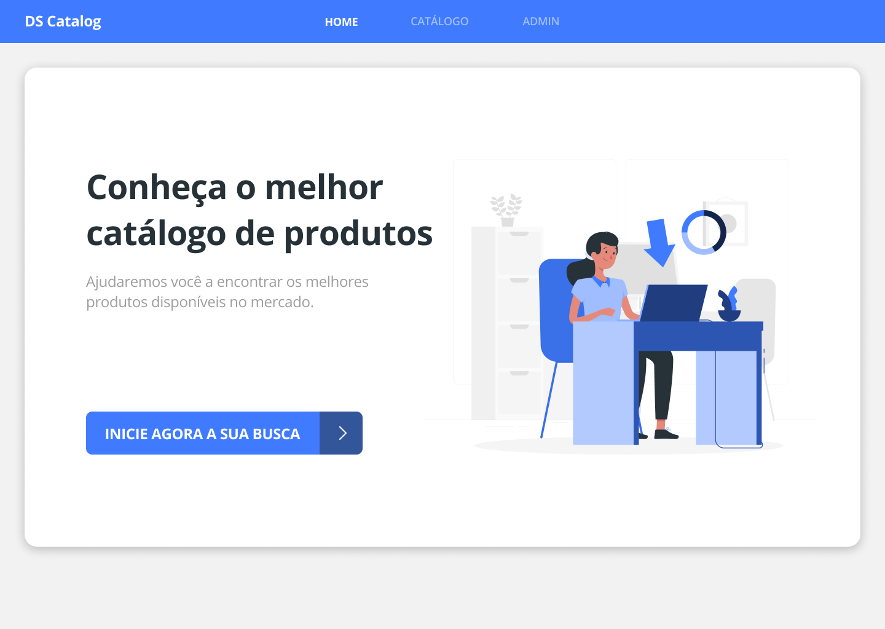
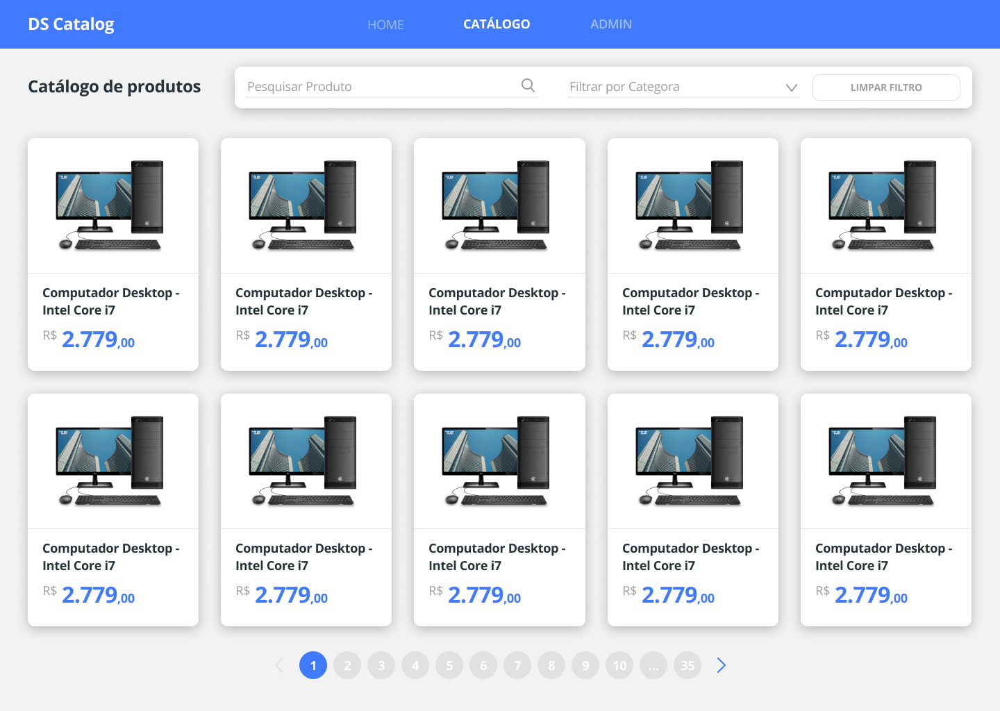
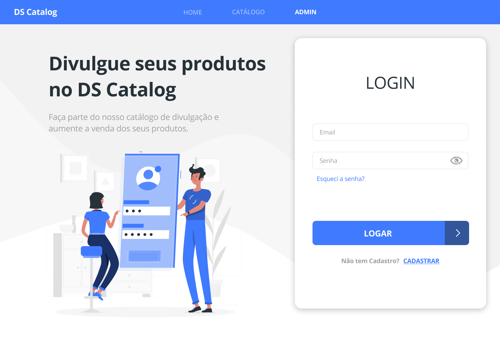
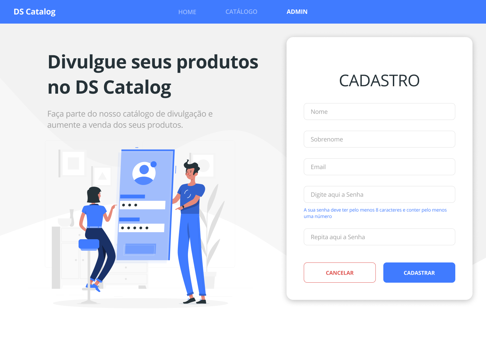

# dscatalog-bootcamp-devsuperior

## Sobre

Este é um projeto desenvolvido através do bootcamp devsuperior. O projeto refere-se a um catalogo de produtos onde o usuário poderá interagir com o sistema a partir de 
um credenciamento feito por um cadastro e em seguida efetuar um login para acesso no sistema. Ele também possui uma seção onde so usuários devidamente autorizados e autenticados tem acesso, um setor administrativo que permite um cadastro de produtos e usuários.

E possível tambem fazer uma visualização detalhada de cada produto além de uma busca por nome e categoria de produtos. Este aplicativo possue também uma busca paginada 
e recursos de crud e upload de imagens somente para usuários de perfil administrador. 

## Informações adicionais

Este projeto foi desenvolvido com a utilização do framework react, e spring boot. Foi utilizado bibliotecas como NPM, bootstramp, typescript. Este aplicativo foi implementado usando o heroku e netlify como plataforma de acesso a nuvem, mas há também algumas funcionalidades implementadas na AWS. 

Também foi desenvolvido uma implementação de entrega contínua, e testes de integração. Ainda foi implementado um container e uma imagem no docker hub, e foi implantado com padrão de camadas na arquitetura rest do spring e injeção de dependência, além de ser construido dentro dos metódos de segurança do oauth2.
 

## Layout

  
  
  
  
  
  
  
  

## Como execultar o projeto

Para execultar o projeto basta importa-lo no vsCode, após clonar o projeto do github na sua máquina e execultar o comando npm start na pasta front-end do projeto, dentro do terminal.
Isso permitira a execução do aplicativo em seu dispositivo na porta que estiver liberada.

